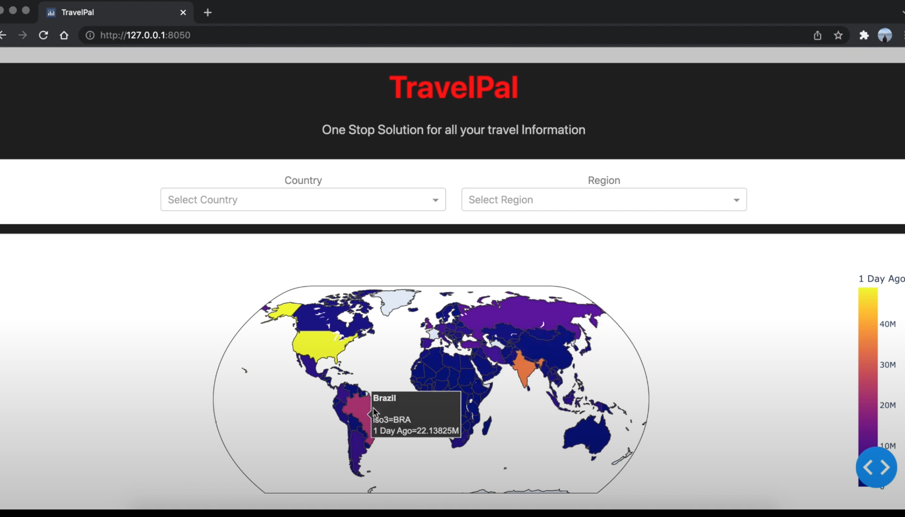
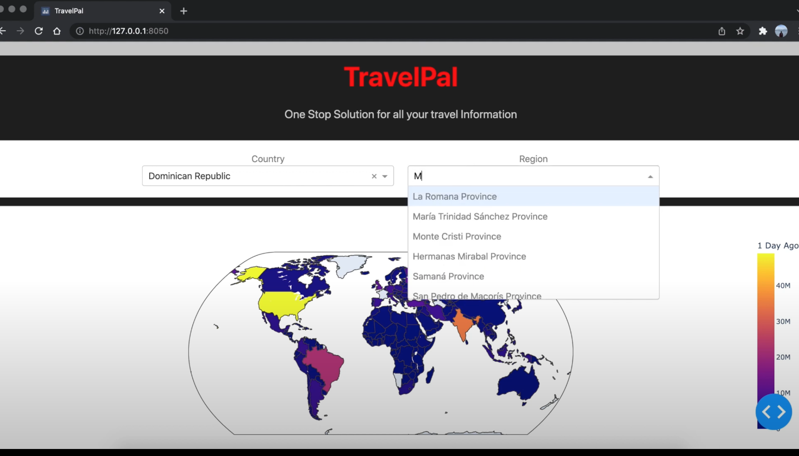
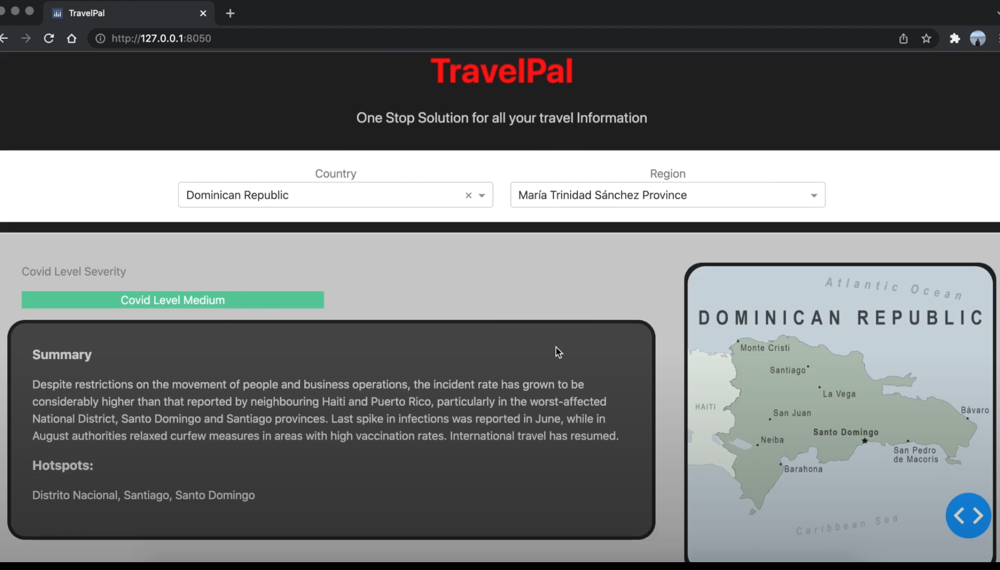
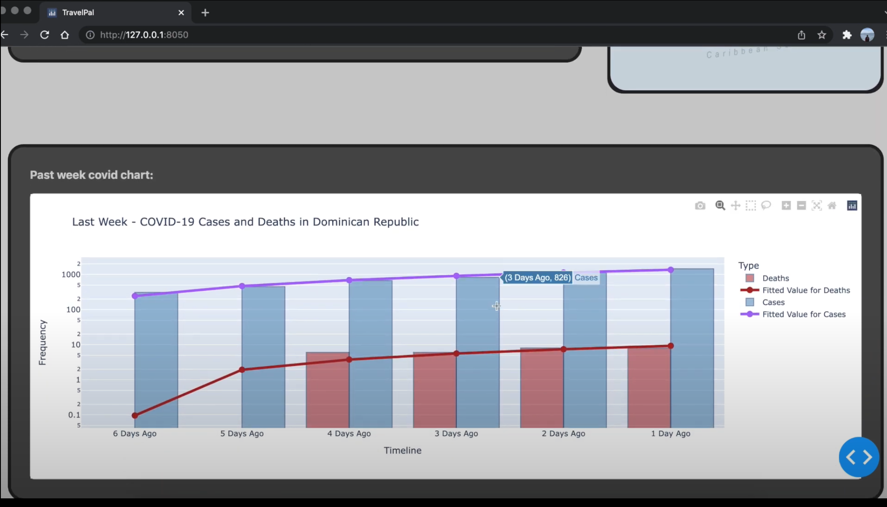
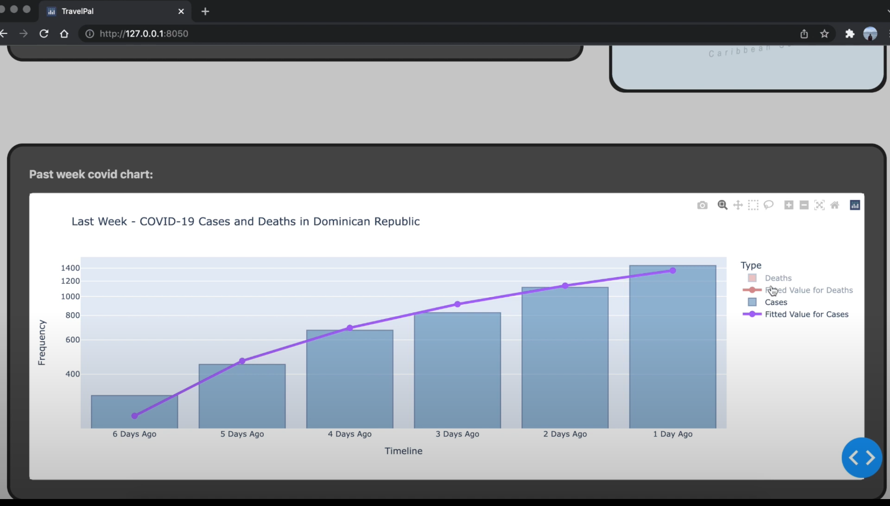
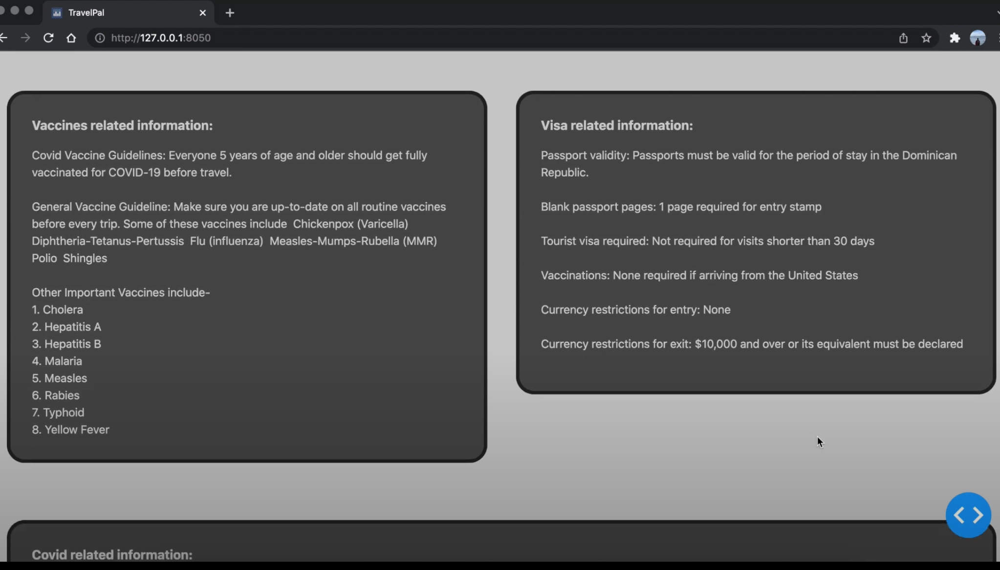
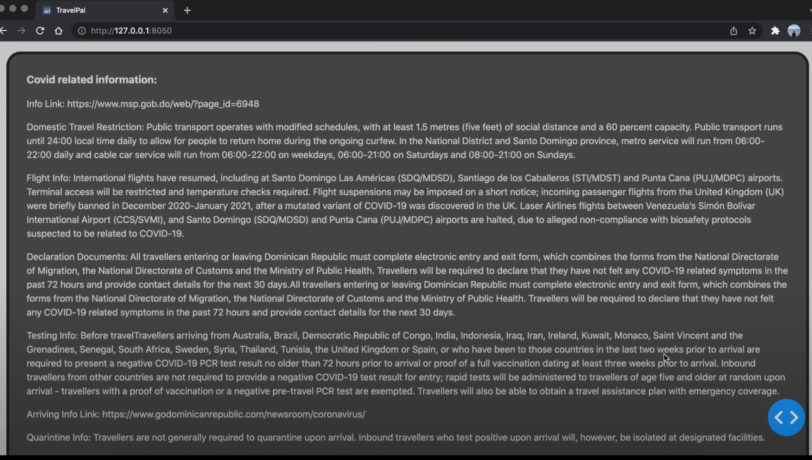
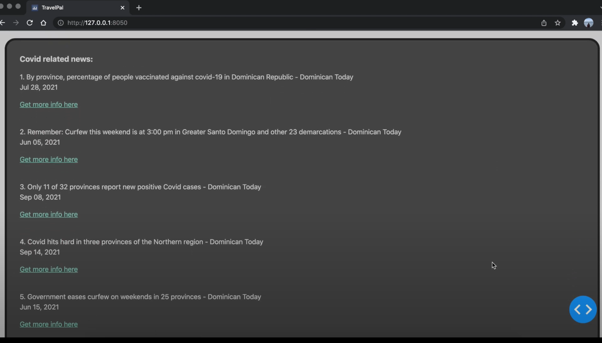
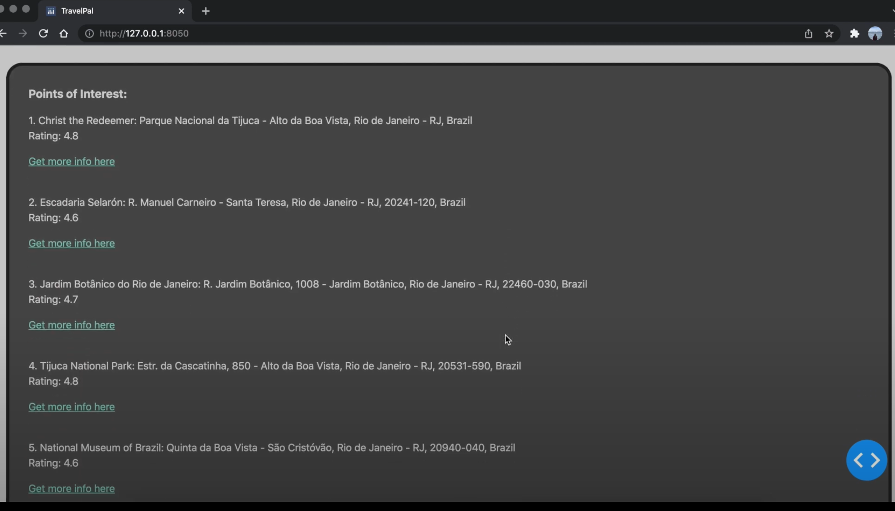

# TravelPal

## Description

**TravelPal** is a one stop application for scrapping and analyzing travel related information including updated covid related guidelines for any country and city. It extracts, analyzes and showcase information from-
 
 - Centers for Disease Control and Prevention (CDC)
 - United States Digital Service (USDS)
 - Google News
 - Google Maps
 - Open Weather
 - CSSE at Johns Hopkins University
 - Amadeus

## Demo

## Requirement

TravelPal uses OpenWeather, Google Maps, and Amadeus API inaddition to CDC and USDS website for scrapping data

- OpenWeather
 - App Key
- Google Maps
 - App Secret key
- Amadeus
 - Client Key
 - Client Secret Key

## Packages

Travel is built using the following Python packages:

- Web Interface
  - Dash
  - Flask
  - CSS
- Data Extraction
  - Requests
  - BackendApplicationClient
- Data Handling
  - Beautiful Soup
  - JSON
- Analysis
  - Linear Regression
  
## Screenshots
  
     
     
     
     
     

## Contributors

- Kelly McManus
- Rishabh Rustogi
- Ayush Khandelwal
- Daniel Deniger 

